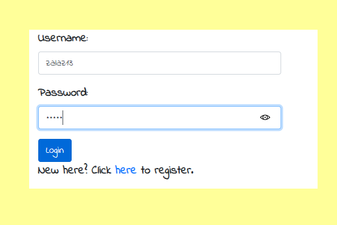
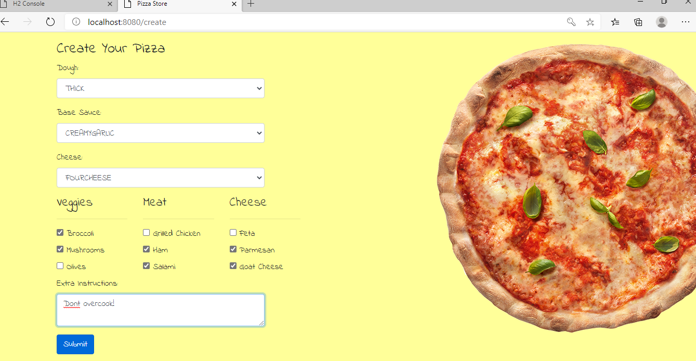
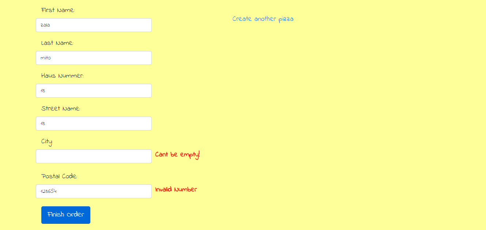

## Pizza Buying WebSite Created with Spring Boot and Thymeleaf.

#### It uses Spring Security with Jpa Authentication to enable users to create an account and login to their accounts.

#### After they log in, users design their pizza.

#### After creating pizza, users fill the delivery form. They can also add another pizza before finishing the order.
#### Before submitting data to the server, it ensures all required form controls are filled out, in the correct format.

